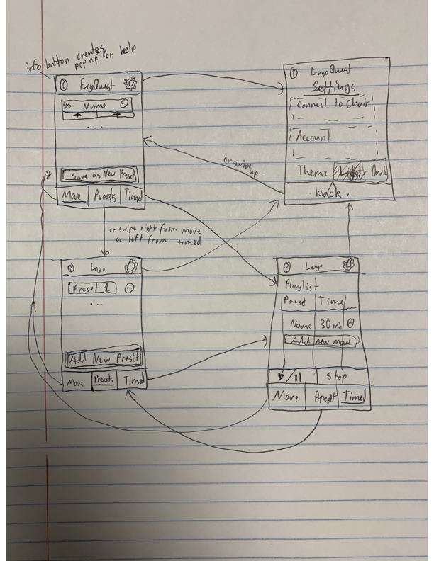
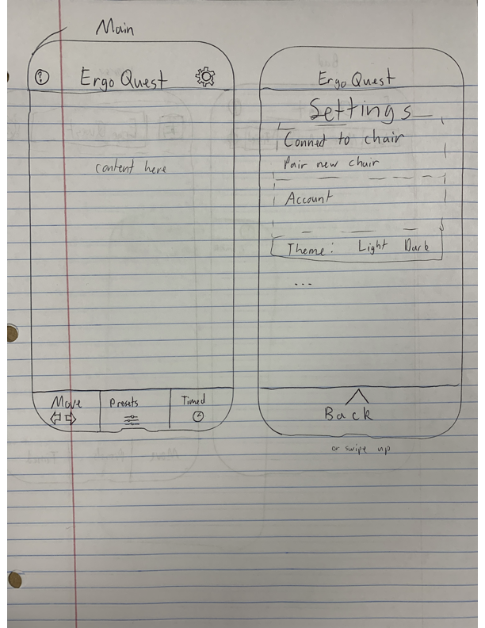
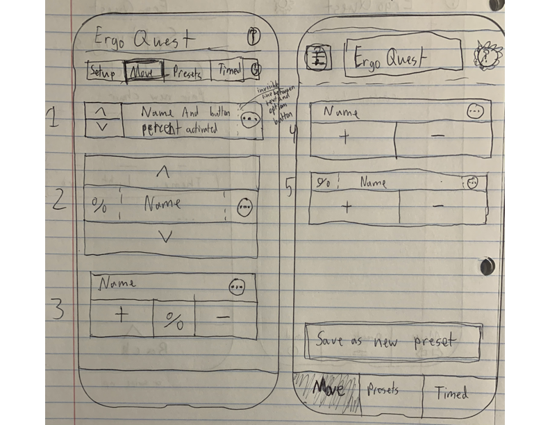
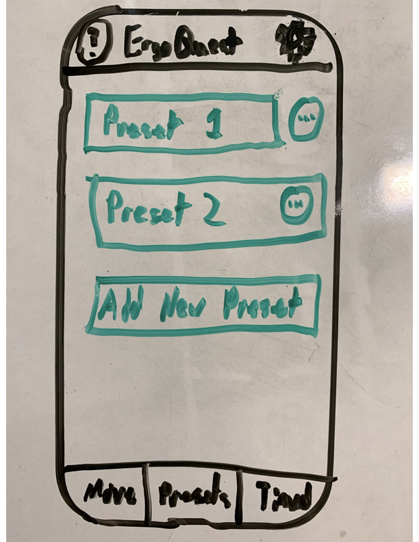
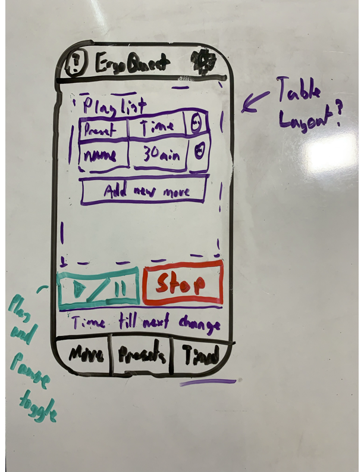
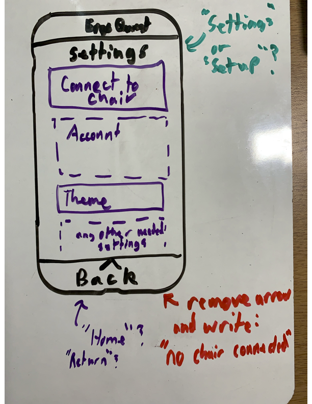

# ErgoQuest Zero-Gravity Chair Controller

## About ErgoQuest
ErgoQuest specializes in crafting zero-gravity workstations tailored for individuals with back issues and physical disabilities, enabling them to work comfortably with minimal discomfort. Their product range encompasses both chairs and workstations, catering to the unique needs of their clients.

## Vision Statement
Currently, ErgoQuest's chairs offer control through physical switches for individual chair motors or via a dedicated app. However, the switches have limited capabilities and lack preset customization. The app, while functional, falls short in terms of user-friendliness and is missing essential features. For instance, some users require periodic chair adjustments to prevent bed sores and circulation problems. Currently, they must manually tweak the chair using switches or select different presets on the app, which lacks a streamlined solution. Notably, ErgoQuest's current app is the sole competition for our upcoming app.

Our mission is to design a new app for ErgoQuest, tailored to manage their zero-gravity chairs. This upgraded app will retain all functionalities of the previous version, including manual chair controls, preset positions, Bluetooth connectivity to chair motors, and customizable motor names. Additionally, it will feature a revamped user interface designed for ease of use, particularly for individuals with disabilities. A significant enhancement will be the introduction of an automated function allowing users to schedule chair transitions between user-defined preset positions at customized time intervals.

## Design
The basic flow of the app revolves around 3 primary screens accessible by swiping or clicking buttons at the bottom of the page and a settings screen accessible by clicking the settings button at the top. The flow can be seen in the image below. Each page has a more detailed view shown in the images further below.

The basic template layout for the 3 primary screens and a skeleton for the settings page.

Move is the page uses to move individual actuators. Different designs discussed by the team can be viewed here. We will likely have the design of the screen on the right using the 5th actuator control design (has "5" to its left).

The presets page will be a simple display of buttons that allow users to click to automatically move to that position (a set of pre-determined values made in the Move page).

The Timed page will contain Play, Pause, and Stop controls for a playlist of presets.

Settings is how users will connect to the chair, login to/create an account, and manage any other settings we develop.

## Team Members
Henry Goldkuhle

Brian Hlathein

Prince Padi

Jacob Vanden Bosch

Joshua Wilson
